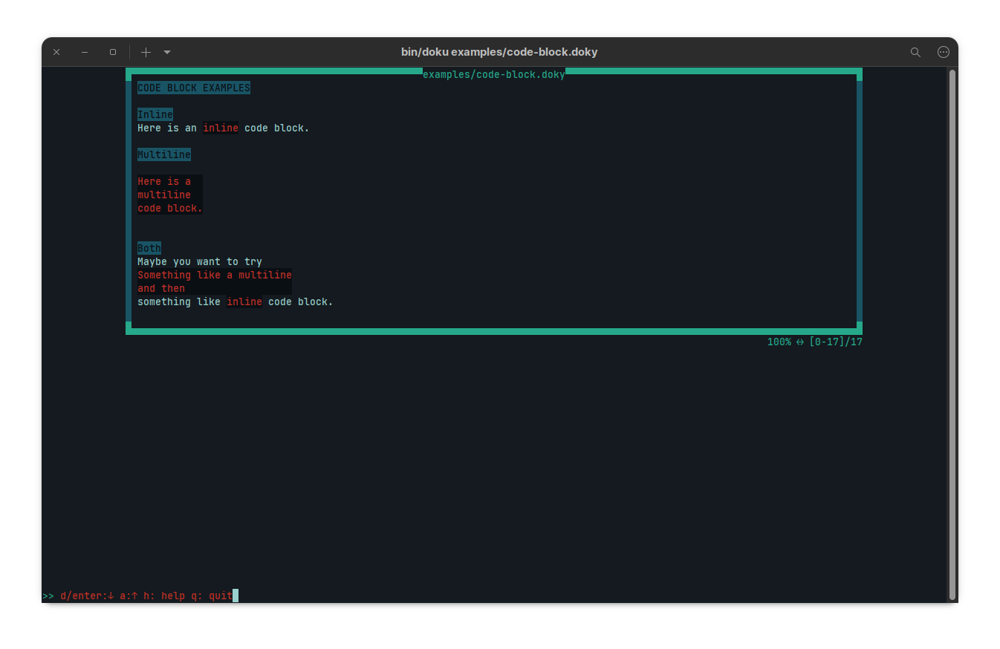
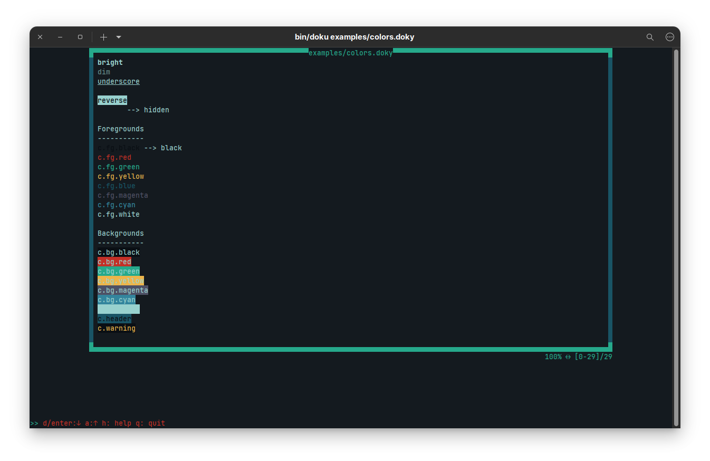
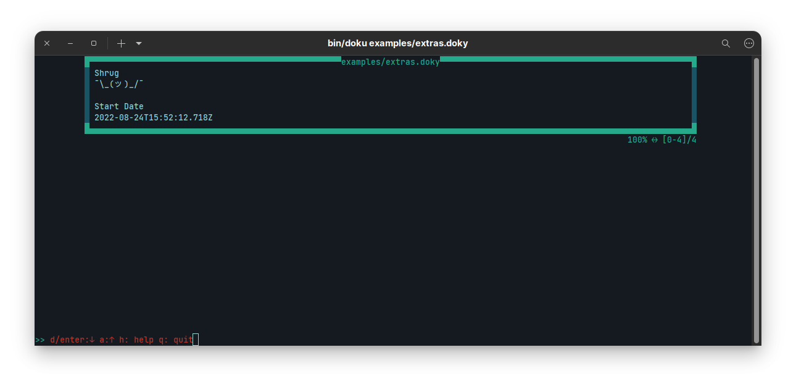

# Doku

Doku.js is a terminal ui text/document viewer that supports a custom documentation syntax called `doky`.

# doky - Custom Documentation Syntax

`doky` has custom commands that allows `doku` to change what is displayed on terminal.

## Table

If you want to display your data in a tabular form, you use following commands:

- `@{begin-table}@`: This command starts table data. Whole line must be `@{begin-table}@` to parse everything correctly.
- `@{end-table}@`: This command ends table data. Whole line must be `@{end-table}@` to parse everything correctly.

In between these two lines with command, you need to provide data as below:

```
| Column | .... | .... | .... |  --> Columns 
|-----------------------------|  --> Separator
| Row1   | .... | .... | .... |  --> Row
| Row2   | .... | .... | .... |  --> Row
```

You can add `|` character to separator line if you want.
There is no left, right or center align.

### Examples

#### Simple
```
@{begin-table}@
| Column 1 | Column 2 | Column 3 |
|----------|----------|----------|
| Data 1-1 | Data 1-2 | Data 1-3 | 
| Data 3-1 | Data 3-2 | Data 3-3 |
@{end-table}@
```

#### Missing Fields 
```
@{begin-table}@
| Column 1 | Column 2 | Column 3 |
|--------------------------------|
| Data 1-1 | Data 1-2 |
| Data 2-1 | | Data 2-3 |
@{end-table}@
```

#### More Complex
```
@{begin-table}@
| Column 1 | Column 2 | Column 3 |
|----------|----------|----------|
| Data 1-1 | Data 1-2 | Data 1-3 | 

| Data 2-1 |
// Inline comment
| Data 3-1      | Data 3-2      | Data 3-3       |
@{end-table}@
```
> Examples are located in `examples/tables.doxy`

**Results**


## Code Block

When you want to display your text in a code block, either multiline or inline, you can 3 backticks (```)

3 backticks start and end any code block.

### Examples

#### Inline
Here is an ```inline``` code block.

#### Multiline
```
Here is a
multiline
code block.
```

#### Both
Maybe you want to try ```
Something like a multiline
and then
```something like ```inline``` code block.

> Examples are located in `examples/code-block.doxy`

**Results**



## Coloring

There are couple of coloring commands.

All coloring commands start with `c` prefix.

| Command           | Effect                                            |
|:-----------------:|---------------------------------------------------|
| `c.reset`         | Resets all coloring effects                       |
| `c.bright`        | Makes font color bright                           |
| `c.dim`           | Makes font color dimmer                           |
| `c.underscore`    | Puts underscore to text                           |
| `c.blink`         | Makes text blink                                  |
| `c.reverse`       | Switches back and foreground color as in selected |
| `c.hidden`        | Makes text hidden                                 |
| `c.fg.black`      | Makes foreground black                            |
| `c.fg.red`        | Makes foreground red                              |
| `c.fg.green`      | Makes foreground green                            |
| `c.fg.yellow`     | Makes foreground yellow                           |
| `c.fg.blue`       | Makes foreground blue                             |
| `c.fg.magenta`    | Makes foreground magenta                          |
| `c.fg.cyan`       | Makes foreground cyan                             |
| `c.fg.white`      | Makes foreground white                            |
| `c.bg.black`      | Makes background black                            |
| `c.bg.red`        | Makes background red                              |
| `c.bg.green`      | Makes background green                            |
| `c.bg.yellow`     | Makes background yellow                           |
| `c.bg.blue`       | Makes background blue                             |
| `c.bg.magenta`    | Makes background magenta                          |
| `c.bg.cyan`       | Makes background cyan                             |
| `c.bg.white`      | Makes background white                            |
| `c.header`        | Blue background + Black Foreground                |
| `c.warning`       | Black background + Yellow Foreground              |

> Examples are located in `examples/colors.doxy`

**Results**




## Extra Commmands

### `shrug`

This command puts `¯\_(ツ⁣)_/¯` into where you put the command.

### `startdate`

This command puts start date time of the application into where you put the command.

> Examples are located in `examples/extras.doxy`

**Results**



## Installation

npm install -g <package name>