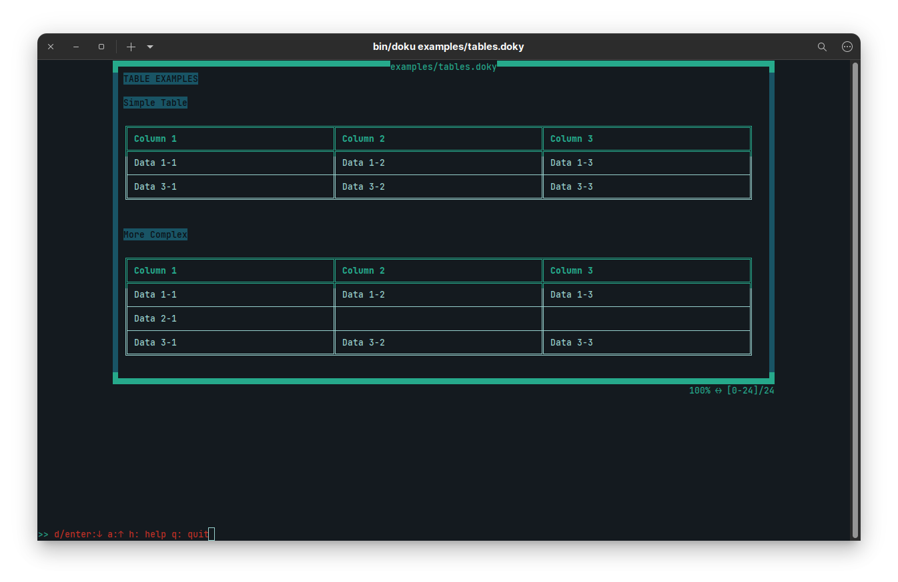

# Doku

Doku.js is a terminal ui text/document viewer that supports a custom documentation syntax called `doky`.

# doxy - Custom syntax

`doky` has custom commands that allows `doku` to change what is displayed on terminal.

## Table

If you want to display your data in a tabular form, you use following commands:

- `@{begin-table}@`: This command starts table data. Whole line must be `@{begin-table}@` to parse everything correctly.
- `@{end-table}@`: This command ends table data. Whole line must be `@{end-table}@` to parse everything correctly.

In between these two lines with command, you need to provide data as below:

```
| Column | .... | .... | .... |  --> Columns 
|-----------------------------|  --> Separator
| Row1   | .... | .... | .... |  --> Row
| Row2   | .... | .... | .... |  --> Row
```

You can add `|` character to separator line if you want.
There is no left, right or center align.

### Examples

#### Simple
```
@{begin-table}@
| Column 1 | Column 2 | Column 3 |
|----------|----------|----------|
| Data 1-1 | Data 1-2 | Data 1-3 | 
| Data 3-1 | Data 3-2 | Data 3-3 |
@{end-table}@
```

#### Missing Fields 
```
@{begin-table}@
| Column 1 | Column 2 | Column 3 |
|--------------------------------|
| Data 1-1 | Data 1-2 |
| Data 2-1 | | Data 2-3 |
@{end-table}@
```

#### More Complex
```
@{begin-table}@
| Column 1 | Column 2 | Column 3 |
|----------|----------|----------|
| Data 1-1 | Data 1-2 | Data 1-3 | 

| Data 2-1 |
// Inline comment
| Data 3-1      | Data 3-2      | Data 3-3       |
@{end-table}@
```
> Examples are located in `examples/tables.doxy`

**Results**




## Installation

npm install -g <package name>