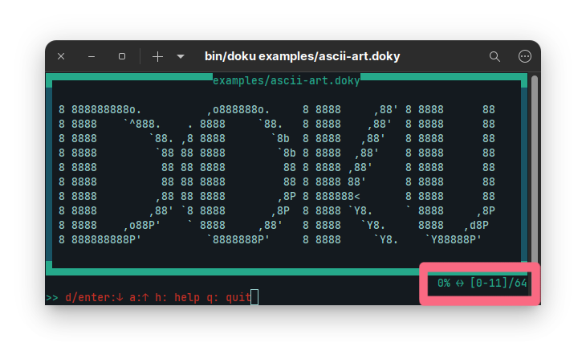

# Doku

Doku.js is a terminal ui text/document viewer that supports a custom documentation syntax called `doky`.


## Features
- Border colors. (all common terminal colors: blue, red, green, yellow, magenta, cyan, white, black, results may change depending on your terminal colors)
- Center content.
- Change frame position.
- Slide text from top to bottom.
- Change common patterns.
- Text search.
- App Commands.

### Common Patterns

| Pattern                  | Better Pattern             |
|--------------------------|----------------------------|
| Line with 10 or more `-` | `▔` (Heading-like)         | 
| Line with 10 or more `_` | `▁` (Heading-like)         | 
| Line with 10 or more `=` | `═` (Heading-like)         | 
| `==>`                    | `⇒`                        |
| `<==`                    | `⇐`                       |
| `-->`                    | `⟶`                        |
| `<--`                    | `⟵`                        |
| 8 or more `-`            | `―`                        |
| 8 or more `_`            | `▁`                        |
| `:=`                     | `≔`                        |
| `=:`                     | `≕`                        |
| `~=`                     | `≈`                        |
| `!=`                     | `≠`                        |

> Examples are located in `examples/patterns.doxy`

**Results**


## Installation

```bash
npm install -g doku.js
```

You can then run doku by simply typing `doku <filename>` on any file you want.

If you don't want to install it globally, then you can install it in any directory you want
then execute it via `npx doku` command.


### Using inside another Node app
If you want to use this library within your project simply add as dependency.
```bash
npm install doku.js
```

After adding as dependency you can simply `require` it.

Example:

``` js
const doku = require("doku");

function stopExecution() {
    process.exit(0);
}

const header = "..."; // Header string that will be displayed at the top of application.
const content = "..."; // String containing document.
const isCentered = true; // Show frame at center.

const dokument = new Doku(content, header, isCentered);
dokument.subToEvent("doku-end", stopExecution);
```

## Details

### Parsing
Doku can render any plain text file as it is. It will parse file on the start then will parse again if terminal resizes.
This parsing will cause change in total number of lines like shown in below.

#### Parsing on smaller displays
Total number of liner decreased.


#### Parsing on larger displays
Total number of liner increased.


### Terminal

Doku clears terminal each time it will do re-rendering. You cannot really access to your terminal since it (stdin) is in raw mode. 

```js
process.stdin.setRawMode(true);
process.stdin.setEncoding('utf8');
process.stdin.resume();
```
## Events

If you included `doku` as dependency to your project, then you'll have two events.

### `doku-start` event

This event will be fired when construction of `doku` object is done.
```js
// To subscribe
doku.subToEvent("doku-start", startHandler);

// To unsubscribe
doku.unsubToEvent("doku-start", startHandler);
```

### `doku-end` event

This event will be fired when deconstruction of `doku` object is occurs.
```js
// To subscribe
doku.subToEvent("doku-end", stopHandler);

// To unsubscribe
doku.unsubToEvent("doku-end", stopHandler);
```

## Actions

Doku has following actions while running application:

| Action                   | Description (all actions are case insensitive)            |
|--------------------------|-----------------------------------------------------------|
| Next Line                | d, Down Arrow, Enter                                      |
| Previous Line            | a, Up Arrow                                               |
| Next Page (20 lines)     | Page Down, Right Arrow                                    |
| Previous Page (20 lines) | Page Up, Left Arrow                                       |
| Go To Start              | s, Home                                                   |
| Go To End                | e, End                                                    |
| Go To Line Number        | Print any number. Press Enter to go, q or ESC to cancel   |
| Cycle Border Colors      | r (blue, red, green, yellow, magenta, cyan, white, black) |
| Center Content           | c                                                         |
| Frame Position           | l                                                         |
| Toggle Text Slide        | t                                                         |
| Toggle Patterns          | p                                                         |
| Find Next                | n (Go to next occurrence of word if exists)               |
| Find Previous            | b (Go to previous occurrence of word if exists)           |
| Open Command Line        | :                                                         |
| Show Help Window         | h                                                         |
| Quit Application         | q or CTRL+C                                               |
| Quit Help                | h                                                         |

## App Commands
While in normal mode (not in command line), if a number is entered as the first character, command line waits a line number to go. If given line number is valid then document will go to that line. You can always cancel command by pressing `ESC` or `q`.

If an error occurs, then command line (alongside with status) will turn red.
For example if user presses `k` which is not mapped, an error like shown below will be displayed. 


If user types `:` then it opens a command line. There are couple of things that users can do:

| Commands | Shortcut | Description                        | Argument Number | Argument Type |
|----------|----------|------------------------------------|-----------------|---------------|
| `switch` | `sw`     | switches state of given command    | 1               | Any           |
| `toggle` | `to`     | toggles given command              | 1               | Any           |
| `find`   | `f`      | find all occurrences of given text | 1               | Any           |
| `time`   | `t`      | sets time for text slide           | 1               | Number        |
| `quit`   | `q`      | quits application                  | 0               | None          |

### Switch Command

| Commands       | Abbr. | Description          | # of Arguments |
|----------------|-------|----------------------|----------------|
| `block       ` |       | changes border block | 0              |
| `border-color` | `bc`  | changes border color | 0              |

### Toggle Command

| Commands     | Abbr. | Description                      | # of Arguments |
|--------------|-------|----------------------------------|----------------|
|`same-color`  | `sc`  | set all borders same color       | 0              |
|`case-ignore` | `ci`  | case sensitivity in find command | 0              |

### 

### Time Command
It sets the time interval to text slide command. Default is 1000ms (1 second).
It takes 1 argument. That argument must be positive number. It is in milliseconds.

### Quit Command
Quits application.

## Screenshots

#### Search Command


#### Searching Next by Pressing `n`


#### Frame Left


#### Frame Center


#### Content Centered


# doky - Custom Documentation Syntax

`doky` has custom commands that allows `doku` to change what is displayed on terminal.

## Table

If you want to display your data in a tabular form, you use following commands:

- `@{begin-table}@`: This command starts table data. Whole line must be `@{begin-table}@` to parse everything correctly.
- `@{end-table}@`: This command ends table data. Whole line must be `@{end-table}@` to parse everything correctly.

In between these two lines with command, you need to provide data as below:

```
| Column | .... | .... | .... |  --> Columns 
|-----------------------------|  --> Separator
| Row1   | .... | .... | .... |  --> Row
| Row2   | .... | .... | .... |  --> Row
```

You can add `|` character to separator line if you want.
There is no left, right or center align.

### Examples

#### Simple
```
@{begin-table}@
| Column 1 | Column 2 | Column 3 |
|----------|----------|----------|
| Data 1-1 | Data 1-2 | Data 1-3 | 
| Data 3-1 | Data 3-2 | Data 3-3 |
@{end-table}@
```

#### Missing Fields 
```
@{begin-table}@
| Column 1 | Column 2 | Column 3 |
|--------------------------------|
| Data 1-1 | Data 1-2 |
| Data 2-1 | | Data 2-3 |
@{end-table}@
```

#### More Complex
```
@{begin-table}@
| Column 1 | Column 2 | Column 3 |
|----------|----------|----------|
| Data 1-1 | Data 1-2 | Data 1-3 | 

| Data 2-1 |
// Inline comment
| Data 3-1      | Data 3-2      | Data 3-3       |
@{end-table}@
```
> Examples are located in `examples/tables.doxy`

**Results**


## Code Block

When you want to display your text in a code block, multiline or inline, you can use 3 backticks (```)

3 backticks start and end code blocks.

### Examples

#### Inline
Here is an \`\`\`inline\`\`\` code block.

#### Multiline
\`\`\`
Here is a
multiline
code block.
\`\`\`

#### Both
Maybe you want to try \`\`\`
Something like a multiline
and then
\`\`\`something like \`\`\`inline\`\`\` code block.

> Examples are located in `examples/code-block.doxy`

**Results**


## Commands
`doky` has a command syntax. The syntax is `@{command}@`.

Any command you want to have will be in between command start (`@{`) and command end (`}@`) characters.

You can put any number of commands in between command start and end characters with comma (`,`) as the delimiter.

If you want to escape any string in a command block, then simply put it in between quotes (`"text"`).
This will make that string to be interpreted as plain text.

For example:

```@{c.fg.white, c.bg.red, "White on Red", c.reset}@```

will put 

## Commands: Coloring

There are couple of coloring commands.

All coloring commands start with `c` prefix.

| Command           | Effect                                            |
|:-----------------:|---------------------------------------------------|
| `c.reset`         | Resets all coloring effects                       |
| `c.bright`        | Makes font color bright                           |
| `c.dim`           | Makes font color dimmer                           |
| `c.underscore`    | Puts underscore to text                           |
| `c.blink`         | Makes text blink                                  |
| `c.reverse`       | Switches back and foreground color as in selected |
| `c.hidden`        | Makes text hidden                                 |
| `c.fg.black`      | Black   Foreground                                |
| `c.fg.red`        | Red     Foreground                                |
| `c.fg.green`      | Green   Foreground                                |
| `c.fg.yellow`     | Yellow  Foreground                                |
| `c.fg.blue`       | Blue    Foreground                                |
| `c.fg.magenta`    | Magenta Foreground                                |
| `c.fg.cyan`       | Cyan    Foreground                                |
| `c.fg.white`      | White   Foreground                                |
| `c.bg.black`      | Black   Background                                |
| `c.bg.red`        | Red     Background                                |
| `c.bg.green`      | Green   Background                                |
| `c.bg.yellow`     | Yellow  Background                                |
| `c.bg.blue`       | Blue    Background                                |
| `c.bg.magenta`    | Magenta Background                                |
| `c.bg.cyan`       | Cyan    Background                                |
| `c.bg.white`      | White   Background                                |
| `c.header`        | Blue background + Black Foreground                |
| `c.warning`       | Black background + Yellow Foreground              |

> Examples are located in `examples/colors.doxy`

**Results**


## Commands: Extras

### `shrug`

This command puts `¯\_(ツ⁣)_/¯` into where you put the command.

### `startdate`

This command puts start date time of the application into where you put the command.

### Escaping Commands

If you ever find yourself in need of escaping certain commands, like in documentation, you can use 
```
@{"@{escaped}@"}@
```

`"@{not escaped}@"` will not be escaped since `@{` and `}@` will be parsed. However, `@{"@{finally escaped}@"}@` will be escaped.

> Examples are located in `examples/extras.doxy`

**Results**


